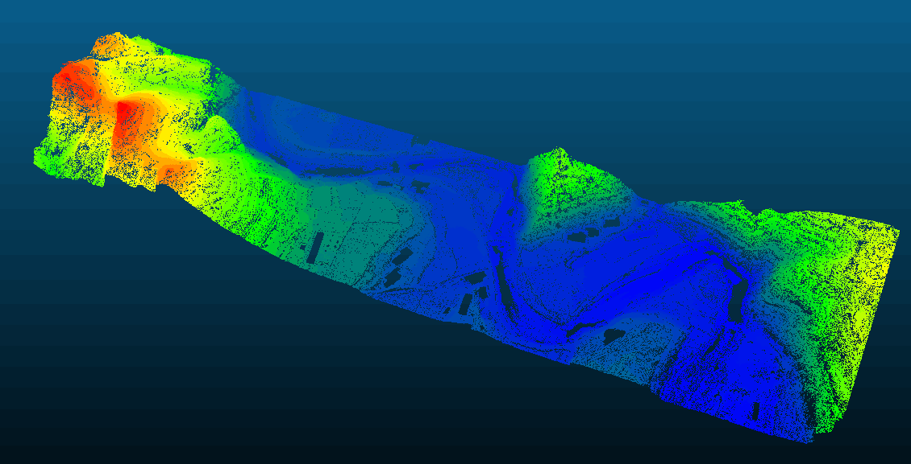

# Free software of Progressive TIN Densification for filtering airborne LiDAR data ----Free PTD  

## 机载LIDAR点云滤波算法之-渐进三角网加密算法免费软件 Free PTD

### Free PTD 是一个免费的机载激光雷达（Lidar)滤波软件,你可以免费使用它，只要是非商业目的使用

### V0.4 发布 <a href = "https://pan.baidu.com/s/1bgZrHP-INJhOH1r9x7a96w "> 百度链接下载</a> 密码：t9ol 详见<a href="#2">V0.4 Release Notes</a>

Free PTD 使用简单的命令行操作来提供处理的参数。使用方式可参见<a href="#0.5">0.5参数设置></a>

Free PTD 使用一个自适应版本的渐进三角网加密算法来进行滤波。其主要是通过迭代来计算自适应
参数从而适应不同的地形，尤其是在陡峭的山区。

可以使用以下命令来处理一个las点云的滤波

    FreePTD -i input_las.las -o output_las.las -d 0.8 -a 15 -m 60 --mt 7 -s  

其中 input_las.las为需要处理的las格式的点云文件；
output_las.las 为处理后的结果文件；其他为参数；
因采用命令行方式，可方便的使用批处理。

Free PTD采用CPU并行方式来进行加速，这可能会引起计算机CPU满负荷工作。
如果点云数量较大，可能需要更多的内存,此时可以采用分块策略即：使用-b <block_size> 命令来进行分块 例如以下命令：

    FreePTD -i input_las.las -o output_las.las -d 0.8 -a 15 -m 60 --mt 7 -b 500 -s

>注意：
Free PTD 不会对点云数据进行外点去除，因为极低点外点会影响滤波结果，所以请确定输入的点云
没有极低点。  
>Free PTD目前版本只提供window 64位，如果有其他操作系统需求，可以<a href="mailto:371000913@qq.com">email我</a>

****

如果在使用的过程中，发现有任何问题，可及时 <a href="mailto:371000913@qq.com">email我</a>

希望你在使用后，可以给我提供处理效果视频、图片，也可以提供原始的点云数据。这会帮助我提供对FreePTD更好的改进。

# <a name="2"> Release Notes</a>
---
## V 0.5
1. 优化了地形中有建筑物也有山体情况的处理效果

<a name="0.5"> 0.5参数设置</a>

+  -i 输入需要滤波的las文件，支持1.0-1.2
+  -o 输出滤波后的las，输入的las数据被分成两类，未分类和地面，参见isprs las格式中分类的类别值
+  -d 点到三角形的距离阈值，默认值0.8
+  -a 点和三角形端点的连线与三角形所在平面最大角阈值，默认值15
+  -m 最大建筑物大小，默认值60
+  --mt 最大树木大小，默认值7
+  -s 自适应标志，如果设置，那么Free PTD会采用自适应的算法来适应地形起伏，尤其是山区中存在大量建筑物
+  -b <block size> 分块设置，block size 为分块大小，单位米(m) 采用分块后，Free PTD会自动进行分块缓存数据，从而减少使用的内存。通常 500 m 的分块大小一般不会使用超过4G的内存，这具体也要看点云的密度。如果内存更小，可以尝试减少分块大小。注意：分块是通过磁盘进行缓存数据，这会占用磁盘空间。Free PTD会使用输入点云input_las的路径缓存一些文件，待Free PTD退出后这些文件会自动删除。

***

## V 0.4
1. 增加分块支持，可显著降低内存需求

<a name="0.4"> 参数设置</a>

+  -i 输入需要滤波的las文件，支持1.0-1.2
+  -o 输出滤波后的las，输入的las数据被分成两类，未分类和地面，参见isprs las格式中分类的类别值
+  -d 点到三角形的距离阈值，默认值1.0  
+  -a 点和三角形端点的连线与三角形所在平面最大角阈值，默认值6
+  -m 最大建筑物大小，默认值60
+  -c 分类标志，如果设置，那么Free PTD会尽量获得地面点。否则Free PTD只会找到一些关键的地形点，这通常地面点数量会比较少，建议开启，但会增加内存使用量
+  -s 自适应标志，如果设置，那么Free PTD会采用自适应的算法来适应地形起伏，尤其是山区，建议开启
+  -b <block size> 分块设置，block size 为分块大小，单位米(m) 采用分块后，Free PTD会自动进行分块缓存数据，从而减少使用的内存。通常 500 m 的分块大小一般不会使用超过4G的内存，这具体也要看点云的密度。如果内存更小，可以尝试减少分块大小。注意：分块是通过磁盘进行缓存数据，这会占用磁盘空间。Free PTD会使用输入点云input_las的路径缓存一些文件，待Free PTD退出后这些文件会自动删除。

***

## V 0.3      
1. 提高地面点数量

## V 0.2       
1. 增加自适应地形处理  
2. 增加角度a和距离d参数，增加分类标志参数c，增加自适应参数s

## V 0.1  
1. 实现算法初始版本
